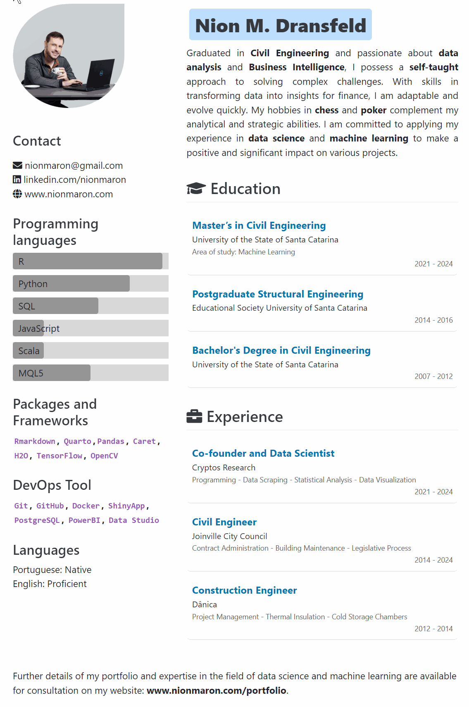

# Nion M. Dransfeld - CV

## Introduction

Welcome to my resume project repository! This project showcases my resume as an interactive and dynamic model created using R programming and Quarto. It's designed to demonstrate my skills and abilities in data analysis and R programming, as well as my proficiency in document creation with Quarto.

## Technologies Used

-   **R**: For data manipulation and analysis.
-   **Quarto**: For creating dynamic and interactive documents.
-   **HTML & CSS**: For custom styling and structure of the web-based resume.

::: {.g-col-6 .g-col-lg-6}
## How to View the Resume

To view my interactive resume:

1. Visit [GitHub Pages Link](https://nionmaron.github.io/Resume-NionMaron/) 
2. Alternatively, clone this repository and run the Quarto document locally on your machine.

## Recent Changes

- **2024-01-06 Print-Specific Modifications**: When printing the document, certain elements will be hidden.The print modifications are automatically activated when the document is printed. 

## Future Improvements

Planned enhancements include: 

- Incorporating real-time data updates.
- Expanding the interactive elements to include more user-driven data exploration.

## How to Contribute

We're always looking for contributions and suggestions! If you'd like to propose changes or add new features, please feel free to open an issue or create a pull request.

:::

::: {.g-col-6 .g-col-lg-6}

## Preview

 
 

:::

